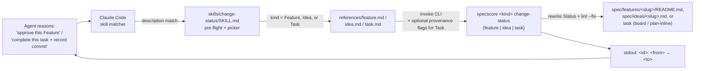

# Feature: Lifecycle Status Skill

> [SpecScore.**Studio**](https://specscore.studio): | [Explore](https://specscore.studio/app/github.com/specscore/ai-plugin-specscore/spec/features/lifecycle-status-skill?op=explore) | [Edit](https://specscore.studio/app/github.com/specscore/ai-plugin-specscore/spec/features/lifecycle-status-skill?op=edit) | [Ask question](https://specscore.studio/app/github.com/specscore/ai-plugin-specscore/spec/features/lifecycle-status-skill?op=ask) | [Request change](https://specscore.studio/app/github.com/specscore/ai-plugin-specscore/spec/features/lifecycle-status-skill?op=request-change) |
**Status:** Stable
**Date:** 2026-05-19
**Owner:** alexander.trakhimenok@gmail.com
**Source Ideas:** lifecycle-status-skill
**Supersedes:** —

## Summary

A dedicated Claude Code skill — `specscore:change-status` — that wraps `specscore feature change-status`, `specscore idea change-status`, and `specscore task change-status` behind one entry point and explicitly advertises itself as the canonical route whenever an AI agent needs to change the lifecycle status of any SpecScore artifact. Serves AI agents executing methodology workflows (`/specify`, `/plan`, `/implement`) that need to transition Feature, Idea, or Task statuses without falling back to direct file edits — and, for the Task kind, to record implementation-commit provenance at completion.

## Problem

The existing `specscore:feature` and `specscore:idea` skills each bundle multiple verbs — list, tree, info, deps, refs, new, change-status (seven total for feature; two for idea). Their `description` frontmatter is dominated by navigation/inspection vocabulary, so when an AI agent reasons "I need to approve this Feature" or "I need to archive this Idea", the skill-matching layer is not reliably triggered into picking the right skill.

A real dogfood session in `synchestra-io/specstudio-skills` confirmed the failure mode: the agent missed `specscore feature change-status` entirely and defaulted to a direct file edit followed by `specscore spec lint --fix` to flip a Feature's `**Status:**`. That path bypasses the CLI's legal-transition validation and audit-event emission — the very guarantees the dedicated verb exists to provide. Surfacing the lifecycle-transition capability as its own skill with a transition-focused description makes the correct path the easy path. See [`spec/ideas/lifecycle-status-skill.md`](../../ideas/lifecycle-status-skill.md) for the full triggering observation.

## Behavior

### Skill identity and discovery

This topic covers what the skill looks like to Claude Code's skill-matching layer — its slug, location, and the description string that determines when an agent retrieves it.

#### REQ: skill-location

The skill MUST reside at `skills/change-status/SKILL.md` in this plugin repository. The directory name (`change-status`) matches the CLI verb the skill wraps and aligns with the existing `references/change-status.md` filenames in `skills/feature` and `skills/idea`. The fully qualified plugin invocation is `specscore:change-status`.

#### REQ: skill-frontmatter

The skill's YAML frontmatter MUST include:

- `name: change-status`
- `description:` — a single string that explicitly advertises the skill as the canonical route for transitioning the lifecycle status of any SpecScore artifact (Feature, Idea, and Task today; extensible to additional kinds later). The description MUST name the action vocabulary an agent is likely to reason in — "change status", "transition", "approve", "archive", "deprecate", "mark stable", "complete a task" — and MUST name the `Feature`, `Idea`, and `Task` artifact kinds so retrieval ranks for any.
- `user-invocable: true` — so users can also trigger the skill directly via `/specscore:change-status`.

#### REQ: description-trigger-coverage

The `description` field MUST cover, at minimum, these intent phrasings: "change status", "transition status", "approve", "archive", "deprecate", "mark stable", "complete a task", plus the artifact kind names ("Feature", "Idea", "Task"). Coverage is checked by inspection during PR review against this REQ; no runtime lint rule exists yet.

### Dispatch by artifact kind

This topic covers what happens after the skill is selected: how the skill figures out which artifact kind the agent is acting on and which CLI verb to invoke.

#### REQ: kind-dispatch

The skill MUST dispatch by artifact kind. The body of `SKILL.md` MUST contain a verb-style picker table mapping each supported kind to its reference file:

| Kind | Reference |
|---|---|
| Feature | `references/feature.md` |
| Idea | `references/idea.md` |
| Task | `references/task.md` |

The picker mirrors the pattern already used by `skills/feature/SKILL.md` and `skills/idea/SKILL.md`. Adding a new kind in the future is a one-row table edit plus a new reference file — exactly how the `Task` row was added.

#### REQ: reference-files

Each reference file MUST exist at the path named in the picker, MUST document the exact CLI invocation for that kind, MUST list the legal `--to` values, MUST list the exit codes inherited from the [shared CLI exit-code contract](https://github.com/specscore/specscore-cli/blob/main/spec/features/cli/README.md#shared-exit-code-contract), and MUST cite the upstream CLI reference URL. References MAY be thin pointers to the existing `change-status.md` files in `skills/feature/references/` and `skills/idea/references/` to avoid duplication, but each MUST stand alone enough that an agent picking the dedicated skill never needs to backtrack into the parent skill. The `references/task.md` file additionally MUST document the optional `--repo`/`--commit`/`--branch` provenance flags (valid only with `--to=complete`), the dual board/plan-inline target resolution, and the `--plan` flag — per the upstream [`cli/task/change-status`](https://github.com/specscore/specscore-cli/blob/main/spec/features/cli/task/change-status/README.md) contract.

### CLI pre-flight and error reporting

This topic covers the runtime contract the skill enforces before invoking any CLI verb, and how it surfaces CLI failures back to the calling agent.

#### REQ: cli-preflight

Before invoking any `specscore` command, the skill MUST verify the CLI is installed via `command -v specscore >/dev/null 2>&1`. On failure (exit `127`), the skill MUST stop and instruct the agent to invoke `/specscore:install` or install directly from `https://specscore.md/install`, matching the pre-flight block already used by `skills/feature/SKILL.md` and `skills/idea/SKILL.md`.

#### REQ: no-fallback-on-cli-failure

The skill MUST NOT silently fall back to direct file edits on any CLI failure. If any wrapped `specscore <kind> change-status` verb (`feature`, `idea`, or `task`) exits non-zero, the skill MUST surface the exit code, the verbatim stderr from the CLI, and the canonical interpretation of that exit code per the shared CLI exit-code contract. The skill MUST NOT re-implement the transition logic in skill prose. Avoiding silent fallback is the entire point of the skill — without this rule, the dogfood failure mode returns.

#### REQ: success-output

On a successful CLI invocation (exit `0`), the skill MUST relay the CLI's single-line `<artifact_id>: <from-status> → <to-status>` output to the agent verbatim. The skill MUST NOT paraphrase, augment, or reformat the diff line.

### Coexistence with existing skills

This topic covers how the new skill relates to the `change-status` references already shipping inside `skills/feature` and `skills/idea`.

#### REQ: deep-links-preserved

The existing `change-status` entries in `skills/feature/SKILL.md`'s and `skills/idea/SKILL.md`'s verb pickers, and the existing `skills/feature/references/change-status.md` and `skills/idea/references/change-status.md` files, MUST remain. Agents that arrive at the change-status capability via a navigation flow (e.g., starting with `specscore:feature` to list features, then deciding to approve one) continue to discover the verb in context. The new dedicated skill is additive, not replacing.

#### REQ: parent-skill-descriptions-unchanged-in-mvp

The `description` frontmatter of `skills/feature/SKILL.md` and `skills/idea/SKILL.md` MUST NOT be edited as part of shipping this Feature. Softening them to de-prioritize change-status is a fast-follow tuning step, gated on the retrieval-A/B follow-up named in [Outstanding Questions](#outstanding-questions). Shipping the dedicated skill first and only then tuning the parents avoids confounding the experiment.

## Architecture & components

### Directory layout

```
skills/change-status/
├── SKILL.md                    # Frontmatter (name, description, user-invocable) + verb picker + pre-flight
└── references/
    ├── feature.md              # Feature change-status invocation, --to values, exit codes
    ├── idea.md                 # Idea change-status invocation, --to values, exit codes
    └── task.md                 # Task change-status: --to values, provenance flags, dual target, exit codes
```

### Unit responsibilities

- **`skills/change-status/SKILL.md`** — declares the skill to Claude Code, advertises the trigger surface to the skill-matching layer, runs the CLI pre-flight check, and routes the agent to one of three reference files based on the artifact kind named in the agent's request. Depends only on the `specscore` CLI being on `PATH` and on the three sibling reference files.
- **`skills/change-status/references/feature.md`** — narrow, single-verb reference for `specscore feature change-status`. Documents the legal `--to` values, the legal-transition matrix, exit codes, and example invocations. Cites and (where helpful) cross-links to `skills/feature/references/change-status.md` to avoid duplicating the canonical content; the dedicated reference owns the content that an agent picking this skill needs first.
- **`skills/change-status/references/idea.md`** — symmetric counterpart for `specscore idea change-status`, including the file-relocation side effect when `--to=archived`.
- **`skills/change-status/references/task.md`** — reference for `specscore task change-status`. Documents the Task legal-transition matrix, the optional `--repo`/`--commit`/`--branch` implementation-commit provenance flags (valid only with `--to=complete`), the dual board / plan-inline target resolution and the `--plan` flag, and the exit codes — per the upstream [`cli/task/change-status`](https://github.com/specscore/specscore-cli/blob/main/spec/features/cli/task/change-status/README.md) contract.

### External dependencies

- `specscore` CLI, specifically the verbs `feature change-status`, `idea change-status`, and `task change-status` (the last carrying the optional implementation-commit provenance flags). The skill assumes the CLI exit-code contract documented in [`specscore-cli/spec/features/cli/README.md`](https://github.com/specscore/specscore-cli/blob/main/spec/features/cli/README.md).
- Claude Code skill-loading machinery, which reads `SKILL.md` frontmatter and exposes the skill via the `Skill` tool and the `/specscore:change-status` slash command.

## Data flow



## Error handling & failure modes

| Failure | Surface | Skill response |
|---|---|---|
| `specscore` CLI not on PATH (exit `127`) | Pre-flight `command -v` check | Stop; instruct agent to run `/specscore:install`. |
| Missing or malformed positional argument, unrecognized `--to` value | CLI exit `2` | Relay stderr verbatim; cite legal `--to` value set from the reference. |
| Artifact does not exist at expected path | CLI exit `3` | Relay stderr; suggest `specscore feature list` or `specscore idea ...` to confirm slug. |
| `(current, --to)` not a legal transition | CLI exit `4` | Relay stderr; cite legal-transition matrix from the reference. |
| I/O failure or `spec lint --fix` failed post-rewrite (rollback applied) | CLI exit `10` | Relay stderr; on-disk state is pre-invocation; do NOT retry automatically. |
| Agent supplied an artifact kind the skill does not yet support (e.g., Plan) | Internal | Stop; surface that the supported kinds today are Feature, Idea, and Task, and the matching CLI verb does not yet exist for the requested kind. Do NOT attempt direct file edits. |
| `--repo`/`--commit`/`--branch` supplied on a Task transition other than `--to=complete` | CLI exit `2` | Relay stderr; cite that provenance flags are valid only with `--to=complete` (per the Task reference). |

The skill never invents a retry, never edits files directly, and never downgrades a non-zero exit to a success.

## Testing strategy

- **Manual dogfood reproduction.** Re-run the original `specstudio:implement` session that motivated this Feature, with the new skill installed. Confirm the agent picks `specscore:change-status` unprompted and never falls back to a direct file edit. This is the primary acceptance signal; no automated harness exists yet.
- **Skill retrieval evals.** Use the existing skill-creator eval harness (referenced in `superpowers:writing-skills`) to score the new `description` against a corpus of transition-intent prompts. The MVP target: the dedicated skill wins retrieval over the parent skills on transition-intent prompts at least 80% of the time. Numbers below are advisory; gating is the manual dogfood.
- **CLI parity check.** A documentation-only check on every CLI bump: diff `specscore feature change-status --help` and `specscore idea change-status --help` against the legal-transition matrix and exit-code table the reference files cite. Drift gates the next plugin release.
- No Rehearse stubs scaffolded — see [`## Rehearse Integration`](#rehearse-integration).

## Rehearse Integration

No Rehearse stubs are scaffolded for this Feature. Rationale:

- The MVP deliverable is a Markdown skill artifact (`SKILL.md` + three reference files). The deliverable has no CLI, HTTP, pure-function, data, UI, filesystem, or event surface that Rehearse can drive.
- The behavioral REQs (retrieval, dispatch, no-fallback) are observable only via the Claude Code runtime and the agent's behavior — neither is in scope for Rehearse today.
- The CLI invariants the skill relies on are owned and tested upstream in `specscore-cli`.

When/if Rehearse grows a "skill retrieval & dispatch" surface, this Feature should be revisited.

## Not Doing / Out of Scope

Inherited from the Idea, plus spec-level cuts:

- A `specscore:lifecycle` umbrella skill that handles list / info / refs verbs in addition to change-status.
- Two split skills (`specscore:feature-status` + `specscore:idea-status`) — explicitly rejected; one unified skill wins.
- Coverage of **Plan** kind transitions in this skill — deferred (the `plan change-status` verb exists upstream, but Plan dispatch from this skill is not in scope here). **Task** is now covered, since the `specscore task change-status` verb shipped.
- Removing the `change-status` references currently shipping inside `skills/feature` and `skills/idea` — they stay as deep links.
- Re-implementing legal-transition validation in skill prose — owned by the CLI.
- Editing the `description` frontmatter of `skills/feature/SKILL.md` and `skills/idea/SKILL.md` — deferred to a fast-follow tuning step gated on retrieval evals.

## Assumption carryover

From [`spec/ideas/lifecycle-status-skill.md`](../../ideas/lifecycle-status-skill.md):

- **Carried over (must-be-true): retrieval triggering.** The skill description must reliably surface for transition-intent prompts. The behavior REQs encode this assumption operationally (`REQ: description-trigger-coverage`), but the validation step — manual dogfood reproduction — remains a post-merge action.
- **Carried over (must-be-true): CLI matrix stability.** The reference files cite the legal-transition matrix and exit codes directly. The CLI-parity check in the testing strategy is the validation hook for this assumption.
- **Carried over (should-be-true): unified vs split.** Decided in favor of unified (`REQ: kind-dispatch`); the assumption survives by virtue of the design choice, not as an open validation.
- **Carried over (should-be-true): no double-retrieval problem.** The MVP ships without softening the parent skills (`REQ: parent-skill-descriptions-unchanged-in-mvp`); the assumption is parked as an [Outstanding Question](#outstanding-questions) to be resolved by retrieval evals.
- **Realized for Task (was might-be-true): scales to new kinds.** The `Task` kind is now dispatched — the one-row picker edit plus `references/task.md`, exactly as the kind-dispatch design predicted, once the `specscore task change-status` verb shipped. Plan dispatch in this skill remains out of scope.

The slug naming open question from the Idea is resolved here in favor of `change-status` (matching the CLI verb) — see [`REQ: skill-location`](#req-skill-location).

## Acceptance Criteria

### AC: skill-shipped (verifies REQ:skill-location, REQ:skill-frontmatter, REQ:description-trigger-coverage)

**Given** a fresh checkout of `ai-plugin-specscore` with this Feature shipped
**When** an inspector reads `skills/change-status/SKILL.md`
**Then** the file exists at exactly that path, its YAML frontmatter contains `name: change-status`, `user-invocable: true`, and a `description` string that includes every intent phrase enumerated in `REQ: description-trigger-coverage` plus the kind names (`Feature`, `Idea`, `Task`).

### AC: dispatch-picker-present (verifies REQ:kind-dispatch, REQ:reference-files)

**Given** `skills/change-status/SKILL.md` has shipped
**When** an inspector reads the file body
**Then** it contains a verb-style picker table with at least the rows `Feature → references/feature.md`, `Idea → references/idea.md`, and `Task → references/task.md`, and all three referenced files exist, each documenting the exact CLI invocation, legal `--to` values, exit codes, and a link to the upstream CLI reference — and `references/task.md` additionally documents the optional `--repo`/`--commit`/`--branch` implementation-commit provenance flags (valid only with `--to=complete`) and the `--plan` flag for plan-inline targets.

### AC: preflight-enforced (verifies REQ:cli-preflight)

**Given** the `specscore` CLI is not installed on `PATH`
**When** an agent invokes the `specscore:change-status` skill (directly or via the skill matcher)
**Then** the skill stops before any change-status attempt and the agent's next message instructs the user to install via `/specscore:install` or `https://specscore.md/install`, with no file edits performed.

### AC: no-silent-fallback (verifies REQ:no-fallback-on-cli-failure)

**Given** an agent invokes the skill against an artifact and the CLI exits with a non-zero code (e.g., exit `4` for an illegal transition)
**When** the skill reports back to the agent
**Then** the agent's resulting reply contains the verbatim CLI stderr and the canonical interpretation of the exit code, and the on-disk artifact's `**Status:**` line is unchanged from before the invocation.

### AC: success-line-relayed (verifies REQ:success-output)

**Given** an agent transitions a Feature from `Draft` to `Approved` via the skill
**When** the CLI exits `0`
**Then** the agent's reply contains the line `<feature_id>: Draft → Approved` (with Unicode `→`, not ASCII `->`) byte-for-byte as emitted by the CLI on stdout.

### AC: deep-links-survive (verifies REQ:deep-links-preserved, REQ:parent-skill-descriptions-unchanged-in-mvp)

**Given** this Feature is shipped
**When** an inspector reads `skills/feature/SKILL.md` and `skills/idea/SKILL.md`
**Then** both skills still list `change-status` in their verb pickers, both still ship their `references/change-status.md` files, and the `description` frontmatter strings on each skill are byte-identical to the pre-Feature versions.

## Open Questions

- Should the parent-skill descriptions on `skills/feature/SKILL.md` and `skills/idea/SKILL.md` be softened to de-prioritize `change-status` once the dedicated skill ships? The MVP defers this to a fast-follow gated on a retrieval A/B; the question is parked, not resolved.
- Should the `Plan` kind also be dispatched by this skill? The `plan change-status` verb exists upstream; adding a `Plan` picker row + `references/plan.md` is the same one-row extension, deferred until there's a clear agent need.
- Plan-inline Task addressing: the upstream `task change-status` verb leaves the exact `### Task N:` addressing token an open question; `references/task.md` must track whatever the CLI pins so the skill's examples stay accurate.

---
*This document follows the https://specscore.md/feature-specification*
